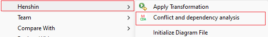
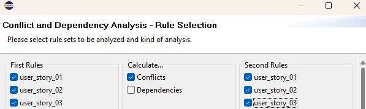
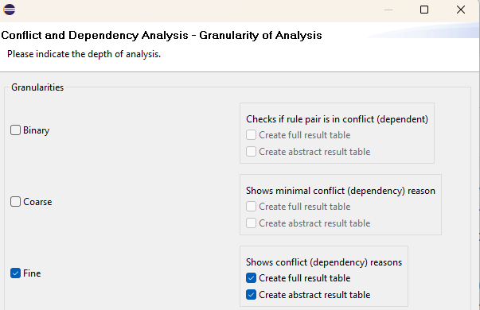
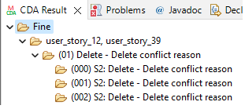
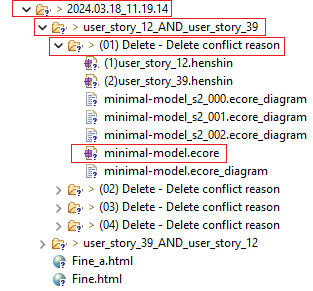
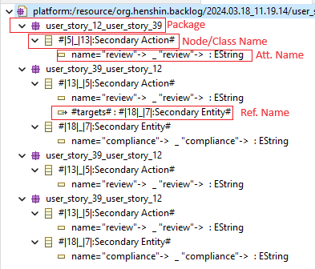
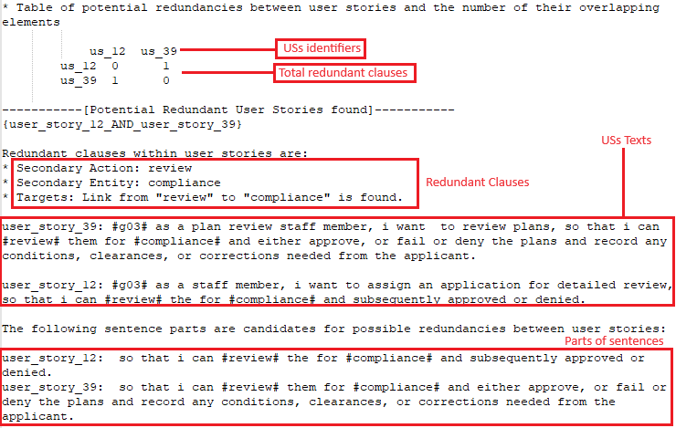
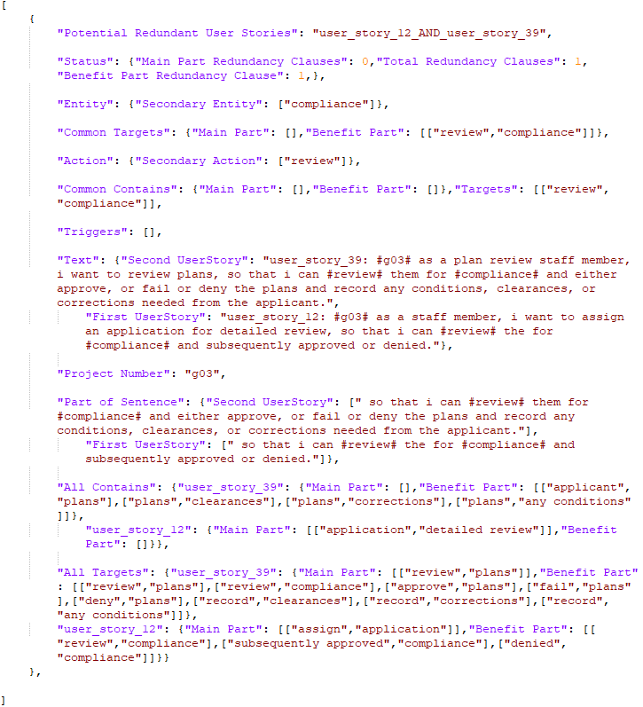

# Step-by-Step Workflow Rollout
This document explains how to apply the workflow steps.
1. **Creating Graph Transformation Rules**
The first step of the design involves a central process in which the US data structured in JSON files is transformed into transformation rules using the Henshin API. This involves the creation of an [Ecore meta-model](./Backlog_v2.3.aird) that represents the structure of the data we are working with, followed by the generation of Henshin transformation rules using [RuleCreator.class](./src/org/henshin/backlog/code/rule/RuleCreator.java).
    -  After we have specified the [config.properties](/config.properties) during [Installation step 7](./README.md#step-by-step-installation-progress-tested-on-windows-1011), we can execute the `RuleCreator.class` to generate ` Henshin files` (e.g., Henshin_backlog_g03.henshin) that contain `graph transformation rules` for each US. After running the RuleCreator.class, the henshin file(s) are saved in the root directory of the project.

1. **Applying CDA**
Now that the rules and the corresponding Henshin file have been created by the RuleCreator class, we can pass them to the CDA to find conflicting rule application overlaps, which we will interpret as potential redundancies.
 
>**Note:** Since the analysis related to the `attribute` is not yet considered in the [CDA API](https://wiki.eclipse.org/Henshin/Conflict_and_Dependency_Analysis), we decided to use the user interface (UI) of the CDA extension of Henshin, which supports analysis of conflict of rules through the interactive use of CDA.

- To apply CDA to Henshin file, we just need to right-click on the Henshin file and select `Henshin` > `conflict and Dependency Analysis` from the context menu.

- A user interface then appears, prompting to select the rule sets to be analysed and the type of analysis. We then select as `First` and `Second` `Rules`, all rules related to USs. Additionally, as the type of analysis we select `conflicts`. 

- On the next page of the CDA UI, we specify the depth of analysis that we use with `Fine granularity` when selecting `Create a complete result table` and `Create an abstract result table`. 

>**Note:** We choose `Fine granularity` as the depth of analysis due to the fact that it shows all conflict reasons for each conflicting rule pair. This allows for a deeper understanding of how different model fragments contribute to conflicts.
- During the execution of the CDA analysis, the rule pairs is analysed and a conflict analysis is performed. Once the calculation is complete, the results are listed in the `CDA` > `Result window`. 

 The top entry shows the granularity, which in our case is `Fine`. These entries contain the rule pairs that conflict with each other. Each rule pair contains a number of conflict reasons.
>**Note:** A conflict reason is a model fragment whose presence leads to a conflict. General conflict reasons result from different combinations of minimal conflict reasons.
- The results directory is created in the directory containing the Henshin that was used for the analyses. The new folder name is the date and time at which the analysis was performed. In contrast to the `CDA` > `Result Window` view, this folder contains all conflict reasons and atoms together in a rule pair directory.

>**Pre-Step (Rename CDA report):** We need to rename the generated CDA report to our conventional format, which is `CDA_Report_backlog_g<Project_ID>`.

>**Pre-Step (Adjusting config.properties)**: Adjusting the `cda.reports` property in [config.properties](./config.properties), which contains the main path of the CDA reports, which can be the project directory.

- For each conflict reason, there is a `minimal-model.ecore` file, that contains packages in which various conflict elements such as `attributes` and `references` (edges) are mapped together and displayed in different packages.

- An attribute has the property of changing the value and is represented by an arrow `->`. The attribute from the first rule is separated from the second rule by an underscore, just as with the nodes.

3. **Report Extraction**
Now we can execute [ReportExtraction.class](./src/org/henshin/backlog/code/report/ReportExtractor.java) to generate the text report and the JSON report, which are located in the directory of the input file.

- To create a lightweight report for the group or individual in question, we need to extract the key information from the CDA report, e.g. redundancy US-pair, redundancy clauses, count of redundancy clauses in each part of the US (main or benefit part), and create a report as a text file with the following information:
    - A table of potential redundant pairs with the number of total redundancy clauses.
	
	- Founded potential redundant US-pairs.
	
	- Redundancy words and clauses of founded US-pairs. Clauses consisting of two words that have one of the relationships triggers, targets or contains.
	
	- Text of US-pairs whose redundancy words are marked with a hash symbol `#`.
	
	- Parts of the sentence in which words and clauses are found.

- For further evaluation purposes and easy export of the report to another platform such as Excel, a JSON report is created that collects the information about redundant US-pairs separately in a JSON object with the following entries:

    - Potential Redundant User Stories:  which has stored the US-pair identifier(e.g. "user\_story\_12\_AND\_user\_story\_39"). 
	
	- Status: consisting of "Main/Beneift Part Redundancy Clauses" and "Total Redundancy Clauses", which store the count of redundancy clauses in the main and benefit part as well as in the total part of the US.
	
	- Entity: which can consist of a "Secondary/Primary Entity" and stores the founded redundant entities.
	
	- Common Targets/Contains: which consists of the "Main Part" and "Benefit Part" entries and only stores the targets/contains relationships that are common between the USs in a particular part of the USs. For example, if there are common redundant targets in the main part of the USs, these are included in the "Main Part" entity of the "Common Targets".
	
	- Text: consisting of two entries, namely "First UserStory" and "Second UserStory", in which the text of the US-pair whose hash symbol has already been applied in redundant phrases is stored.
	
	- Project Number: stores the the Project identifier (e.g. "G03").
	
	- Part of Sentence: consists of the entries "First UserStory" and "Second UserStory", in which the part of the US sentences containing redundant clauses is stored.
	
	- All Targets/Contains: which consists of the "Main Part" and "Benefit Part" entries and stores the whole targets/contains relationships that are occurred in the particular part of the USs.

    

<!--## US labelling in JSON files
As the annotated USs in the JSON files do not contain identifiers, a  [customised Python script](https://github.com/amirrabieyannejad/USs_Annotation/tree/main/Skript/nummerize_us), is used to assign an unique identifier to each US, which is stored in a JSON object named `US_Nr`-->

## Gathering all Extracted report using VBa
In order to evaluate the extracted reports from 19 datasets, we use a [VBa acript](https://github.com/amirrabieyannejad/USs_Annotation/tree/main/Skript/extractFromJSONFiles) which read the extracted information from JSON-report and gather the information like `PID`, `user story pair`, `Text of user story pair`, `Main/Benefit/Total Redundancy Clauses`, and assessing the main/benefit part of user stories as `full` or `partial` `redundant`.