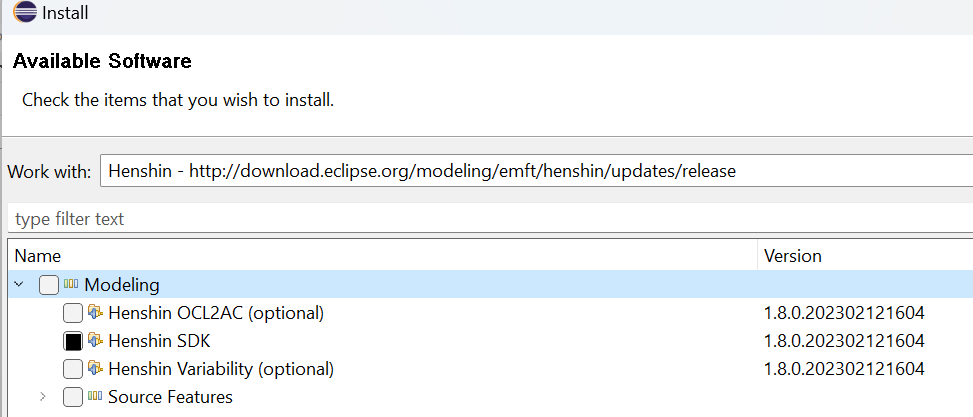

# Redundancy Analysis
Our system initiates with backlogs annotated with [Doccano tool](https://github.com/ace-design/nlp-stories) generated by Mosser et al. as the primary input. These annotated USs are used to generate `graph transformation rules` for each US in the backlog using [Henshin](https://wiki.eclipse.org/Henshin/Compact_API) tool.

Subsequently, these rules serve as inputs for the Henshin [Conflict and Dependency Analysis](https://wiki.eclipse.org/Henshin/Conflict_and_Dependency_Analysis) (CDA) tool , which automates the identification of potentially redundant US pairs. The output from the CDA tool is then utilized to create a report that compiles information on these potentially redundant pairs. This report, in turn, becomes the input for the evaluation process, which outputs statistical data concerning redundancy among USs.
Following Figure illustrates how each step in this sequence is interconnected, with the output of one step feeding directly into the next. This diagram effectively demonstrates the toolchain and process workflow, highlighting how each tool transforms artefacts and contributes to the overall objective of redundancy detection.

## Requirement
*  [Eclipse](https://www.eclipse.org/downloads/packages/release/2023-03/r) version `2023-03`
*  [Henshin](https://download.eclipse.org/modeling/emft/henshin/updates/release/) version `4` cannot be installed with the latest version of Eclipse
*  [Eclipse Modelling Project](https://eclipse.dev/modeling/)
*  [Henshin API](https://wiki.eclipse.org/Henshin/Compact_API) `Compact API`
*  JDK 15.0.1, JUnit 4.10
    * `org.json`,  `org.eclipse.core.*`, `org.eclipse.emf.henshin.multicda.cda.source`

##  Step-by-step installation progress on Windows 10/11
1. **Installing Eclipse Modeling Tools Version 2023-03** 
* Since Henshin version 4 cannot be installed with the latest version of the Eclipse Modeling Tools (2023-12 or higher), we need to install version 2023-03 of [hier](https://www.eclipse.org/downloads/download.php?file=/technology/epp/downloads/release/2023-03/R/eclipse-scout-2023-03-R-win32-x86_64.zip).
* After downloading the zip data, unzip the file, change to the `eclipse/` directory and start `eclipse.exe`.
Set the workspace directory and click on `Lunch` to initiate the Eclipse workspace.

2. **Installing Java SE Development Kit 15.0.2** 
* Download the JDK 15.0.2 from [oracle](https://www.oracle.com/java/technologies/javase/jdk15-archive-downloads.html) (registration is required).
* Install Java SE Development Kit 15.0.2 (admin rights is required).

3. **Configuration JDK on Eclipse** 
* Click on the menu bar `Preference` in Eclipse.
* Navigate to 'Java' > 'Installed JREs' and click ‘Add’ to define newly installed JREs.
* Select `Standard VM` and click on `Next`.
* In the 'JRE home' field, enter the directory in which JRE 15.0.2 is located and click 'Finish'.
* Select the created VM and the rest in the list will be automatically deactivated and click on `Apply and Close`.

4. **Installing Henshin**
* Henshin is generally installed via update site. Hence, to install Henshin, open Eclipse, go to `Help` -> `Install New Software...` and use the following update site URL:
[http://download.eclipse.org/modeling/emft/henshin/updates/release](http://download.eclipse.org/modeling/emft/henshin/updates/release).
* Give a Repository `Name` (e.g. Henshin) and click `Add`.
*  After loading, the following list is displayed:
* Select `Henshin SDK` and click `Next >`. 
* After installation click `Next >` and accept User Agreement and click `Finish`.
* During the installation, the `Trust` dialog box `Select All` appears and click `Trust Selected`.
* Restart Eclipse IDE.

5. **Clone the Repository**
<pre><code>
$ cd path/to/directory
$ git clone git@github.com:amirrabieyannejad/Redundancy_Analysis.git
</code></pre>
6. **Open the project in Eclipse**
* Go to `File` > `Open projects from file system` in the menu bar.
* Navigate to the project directory and click on `Finish`.

7. **Change `config.properties`**
* Open the file `config.properties`, which is located in the root directory of the project, and adjust the values as follows:
    
    | Property | Description | Example |
    |----------|-------------|---------|
    |`base.directroy`|The absolute path where the project is located|<pre><code>base.directroy=C:/users/eclipse-workspace/org.henshin.backlog</code></pre>|
    |`project.ids`| Add the project-IDs related to each dataset in order to applying redundancy analysis separated by comma (with or without space)|<code><pre>project.ids=03, 04, 05, 11</code></pre>|
    |`cda.reports`| CDA report directory in which the CDA reports are to be saved. Please rename the created report name (CDA creates a directory with the current date and time in project directory) to `CDA_Report_backlog_g<Project_ID>`, where the project-ID corresponds to the second property in the config.properties file.|<code><pre>cda.reports=C:/users/eclipse-workspace/CDA_Reports</code></pre>|
    
    ****For defining paths in config.properties file use `'/'` instead of `'\'`.**

## US labelling in JSON files
As the annotated USs in the JSON files do not contain identifiers, a  [customised Python script](https://github.com/amirrabieyannejad/USs_Annotation/tree/main/Skript/nummerize_us), is used to assign an unique identifier to each US, which is stored in a JSON object named `US_Nr`

## Gathering all Extracted report using VBa
In order to evaluate the extracted reports from 19 datasets, we use a [VBa acript](https://github.com/amirrabieyannejad/USs_Annotation/tree/main/Skript/extractFromJSONFiles) which read the extracted information from JSON-report and gather the information like `PID`, `user story pair`, `Text of user story pair`, `Main/Benefit/Total Redundancy Clauses`, and assessing the main/benefit part of user stories as `full` or `partial` `redundant`.

